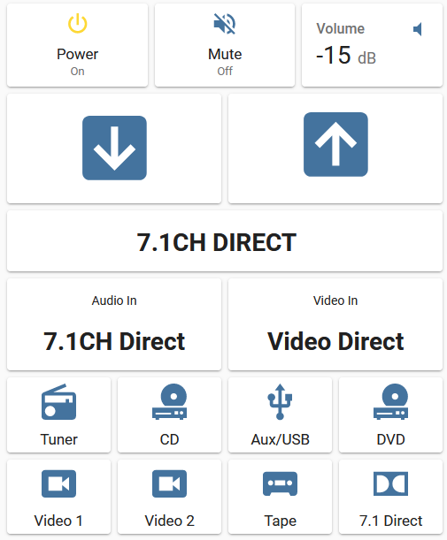

# Outlaw Audio 990 AV Preamp/Processor Custom ESPHome Component

This custom component will communicate with an Outlaw Audio 990 via RS232 serial port (UART) to provide control and status feedback.  You can use the component in automations, or to create a basic remote control in the Dashboard.

## ESPHome Configuration

Required additions to your ESPHome `yaml` file below (set rx and tx pins of the UART as needed):

```
external_components:
  - source: github://tangentaudio/esphome_outlaw990

uart:
  rx_pin: GPIO14
  tx_pin: GPIO13
  baud_rate: 9600
  id: uart1

outlaw_990:
  id: outlaw
  uart_id: uart1

binary_sensor:
  - platform: outlaw_990
    sensor_power:
      name: "Outlaw Power Status"
    sensor_mute:
      name: "Outlaw Mute Status"

sensor:
  - platform: outlaw_990
    sensor_volume:
      name: "Outlaw Volume Status"

text_sensor:
  - platform: outlaw_990
    sensor_display:
      name: "Outlaw Display"
    sensor_audio_in:
      name: "Outlaw Audio Input"
    sensor_video_in:
      name: "Outlaw Video Input"
```

## Example Dashboard Configuration

The code for an example remote control Lovelace dashboard card is shown below.  Note that it uses the entity names as configured above.  The card is also conditional, and it will not be shown if the ESPHome device is unavailable.  Additional elements within the card are also conditional based on whether the Outlaw is turned on.



Code for the dashboard example:

```
type: conditional
conditions:
  - entity: binary_sensor.outlaw_power_status
    state_not: unavailable
card:
  type: vertical-stack
  cards:
    - type: horizontal-stack
      cards:
        - show_name: true
          show_icon: true
          name: Power
          type: button
          tap_action:
            action: call-service
            service: esphome.av_control_outlaw_power
            data:
              power: true
            target: {}
          entity: binary_sensor.outlaw_power_status
          icon_height: 32px
          hold_action:
            action: call-service
            service: esphome.av_control_outlaw_power
            data:
              power: false
            target: {}
          icon: mdi:power
          show_state: true
        - type: conditional
          conditions:
            - entity: binary_sensor.outlaw_power_status
              state: 'on'
          card:
            show_name: true
            show_icon: true
            name: Mute
            type: button
            tap_action:
              action: call-service
              service: esphome.av_control_outlaw_mute
              data: {}
              target: {}
            entity: binary_sensor.outlaw_mute_status
            icon_height: 32px
            icon: mdi:volume-off
            show_state: true
        - type: conditional
          conditions:
            - entity: binary_sensor.outlaw_power_status
              state: 'on'
          card:
            type: entity
            entity: sensor.outlaw_volume_status
            icon: mdi:volume-low
            name: Volume
    - type: conditional
      conditions:
        - entity: binary_sensor.outlaw_power_status
          state: 'on'
      card:
        type: horizontal-stack
        cards:
          - show_name: false
            show_icon: true
            type: button
            tap_action:
              action: call-service
              service: esphome.av_control_outlaw_volume_adj
              data:
                up: false
              target: {}
            entity: ''
            icon: mdi:arrow-down-box
          - show_name: true
            show_icon: true
            type: button
            tap_action:
              action: call-service
              service: esphome.av_control_outlaw_volume_adj
              data:
                up: true
              target: {}
            entity: ''
            icon: mdi:arrow-up-box
    - type: markdown
      content: >
        # <center> {{ states('sensor.outlaw_display') + ' ' | replace(' ',
        '\u2800') }} </center>
      style:
        text-align: center
    - type: conditional
      conditions:
        - entity: binary_sensor.outlaw_power_status
          state: 'on'
      card:
        type: horizontal-stack
        cards:
          - type: markdown
            content: |
              <center> Audio In </center>

              # <center> {{ states.sensor.outlaw_audio_input.state }} </center>
          - type: markdown
            content: |
              <center> Video In </center>

              # <center> {{ states.sensor.outlaw_video_input.state }} </center>
    - type: conditional
      conditions:
        - entity: binary_sensor.outlaw_power_status
          state: 'on'
      card:
        type: horizontal-stack
        cards:
          - show_name: true
            show_icon: true
            type: button
            tap_action:
              action: call-service
              service: esphome.av_control_outlaw_command
              data:
                cmd: 3
              target: {}
            icon: mdi:radio
            name: Tuner
          - show_name: true
            show_icon: true
            type: button
            tap_action:
              action: call-service
              service: esphome.av_control_outlaw_command
              data:
                cmd: 4
              target: {}
            name: CD
            icon: mdi:disc-player
          - show_name: true
            show_icon: true
            type: button
            tap_action:
              action: call-service
              service: esphome.av_control_outlaw_command
              data:
                cmd: 5
              target: {}
            name: Aux/USB
            icon: mdi:usb
          - show_name: true
            show_icon: true
            type: button
            tap_action:
              action: call-service
              service: esphome.av_control_outlaw_command
              data:
                cmd: 7
              target: {}
            icon: mdi:disc-player
            name: DVD
    - type: conditional
      conditions:
        - entity: binary_sensor.outlaw_power_status
          state: 'on'
      card:
        type: horizontal-stack
        cards:
          - show_name: true
            show_icon: true
            type: button
            tap_action:
              action: call-service
              service: esphome.av_control_outlaw_command
              data:
                cmd: 8
              target: {}
            icon: mdi:video-box
            name: Video 1
          - show_name: true
            show_icon: true
            type: button
            tap_action:
              action: call-service
              service: esphome.av_control_outlaw_command
              data:
                cmd: 9
              target: {}
            name: Video 2
            icon: mdi:video-box
          - show_name: true
            show_icon: true
            type: button
            tap_action:
              action: call-service
              service: esphome.av_control_outlaw_command
              data:
                cmd: 13
              target: {}
            name: Tape
            icon: mdi:cassette
          - show_name: true
            show_icon: true
            type: button
            tap_action:
              action: call-service
              service: esphome.av_control_outlaw_command
              data:
                cmd: 14
              target: {}
            icon: mdi:dolby
            name: 7.1 Direct
```
